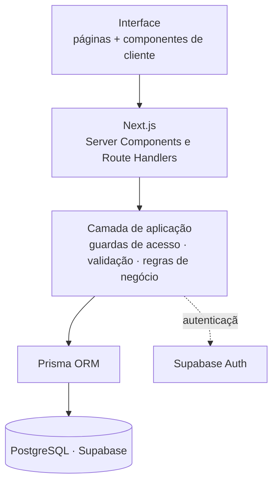

# Pulse Training

Plataforma full-stack para personal trainers gerenciarem alunos, treinos, agenda e evolução física,
com um portal dedicado em que cada aluno acompanha o próprio treino pelo celular.

| 58 | 25 | 18 | 16 | 558 |
| :-: | :-: | :-: | :-: | :-: |
| endpoints de API | páginas | modelos de dados | migrations | testes automatizados |

> **Showcase técnico.** Este repositório apresenta a arquitetura, as decisões de engenharia e as
> telas do Pulse Training. Por se tratar de um produto em desenvolvimento comercial, o código-fonte
> e o ambiente da aplicação são privados e não estão disponíveis publicamente.

---

## <picture><source media="(prefers-color-scheme: dark)" srcset="docs/icons/dark/monitor-smartphone.svg"></picture> Demonstração

Duas áreas sobre o mesmo dado: a ferramenta de trabalho do personal e o app de treino do aluno.

<table>
  <tr>
    <td width="68%" valign="top">
      
       
      <b>Personal · Visão geral</b> — atendimentos do dia, alunos ativos, próximos agendamentos e avaliações recentes.
    </td>
    <td width="32%" valign="top" align="center">
      
       
      <b>Aluno · Portal mobile</b> — treino do dia e execução série a série, desenhado para o celular.
    </td>
  </tr>
</table>

<table>
  <tr>
    <td width="50%" valign="top">
      
       
      <b>Personal · Montagem da ficha</b> — séries, repetições, carga e descanso por exercício, com reordenação.
    </td>
    <td width="50%" valign="top">
      
       
      <b>Personal · Agenda</b> — semana com atendimentos, horários livres e bloqueios. Sobreposição impedida pelo banco.
    </td>
  </tr>
  <tr>
    <td width="50%" valign="top">
      
       
      <b>Aluno · Evolução</b> — progressão de carga por exercício, treino a treino, a partir do que foi de fato registrado na execução.
    </td>
    <td width="50%" valign="top">
      
       
      <b>Personal · Carteira de alunos</b> — busca, status, próximo treino e última avaliação.
    </td>
  </tr>
</table>

  
   
  <b>Autenticação</b> — acesso único para Personal e aluno, com limite de tentativas.

---

## <picture><source media="(prefers-color-scheme: dark)" srcset="docs/icons/dark/info.svg"></picture> Sobre o projeto

O acompanhamento entre personal trainer e aluno costuma ficar espalhado: a ficha em PDF no
WhatsApp, os horários em um caderno, as medidas em uma planilha e a carga da semana passada na
memória de quem treinou. Nenhuma dessas informações conversa com as outras.

O Pulse Training reúne esse fluxo em uma aplicação só, com duas visões do mesmo dado:

- **Para o personal**, uma ferramenta de trabalho — carteira de alunos, biblioteca de exercícios,
  montagem de fichas, programação semanal, agenda com regras próprias, avaliações de composição
  corporal e um canal de feedback.
- **Para o aluno**, um app de treino — o que fazer hoje, quanto levantar, quanto descansar, o
  histórico do que já foi feito e a evolução em gráfico.

O isolamento entre contas é requisito de projeto, não detalhe de implementação: um aluno acessa
apenas os próprios dados e um personal apenas os alunos vinculados a ele.

---

## <picture><source media="(prefers-color-scheme: dark)" srcset="docs/icons/dark/code-xml.svg"></picture> Destaques de engenharia

- **Full-stack em uma aplicação** — páginas e API no mesmo Next.js, com duas interfaces sobre o
  mesmo banco; o portal do aluno é desenhado para o celular.
- **Modelagem relacional de um domínio real** — 18 modelos no PostgreSQL, com o histórico de treino
  guardado como retrato do momento, para que editar uma ficha não reescreva o passado.
- **Autorização e isolamento multi-tenant** — o dono do dado vem da sessão e entra no filtro de
  toda consulta; papel lido do banco, não do token.
  [Detalhes](#isolamento-entre-contas-em-um-banco-multi-tenant)
- **Invariante crítica garantida pelo banco** — conflito de agenda impedido por constraint de
  exclusão, não por uma verificação na aplicação.
  [Detalhes](#corrida-por-um-mesmo-horário-na-agenda)
- **Datas e fuso horário tratados de forma explícita** — data de calendário separada de instante,
  com o fuso da aplicação fixado em um único módulo.
  [Detalhes](#data-de-calendário-não-é-o-mesmo-que-instante)
- **Entrada externa tratada como hostil** — uploads validados por decodificação e limite de
  tentativas compartilhado entre instâncias.
  [Detalhes](#upload-de-imagem-que-não-confia-no-cliente)
- **Testes pelo caminho real** — 558 testes contra um build de produção, por HTTP, sem mock de
  banco nem de sessão. [Detalhes](#-qualidade)

---

## <picture><source media="(prefers-color-scheme: dark)" srcset="docs/icons/dark/layout-dashboard.svg"></picture> Principais funcionalidades

### Personal Trainer

| Área | O que faz |
| --- | --- |
| **Alunos** | Cadastro com senha temporária, busca, edição e desativação sem perder o histórico |
| **Exercícios** | Biblioteca própria com grupo muscular, imagem e vídeo; arquivamento em vez de exclusão quando já está em uso |
| **Treinos** | Fichas com séries, repetições, carga, descanso e observações; reordenação, duplicação e transferência entre alunos |
| **Programação** | Semana do aluno (segunda: Treino A, quarta: Treino B) e o treino previsto para qualquer data |
| **Agenda** | Horários de trabalho, bloqueios, confirmação, cancelamento e reagendamento |
| **Avaliações** | Bioimpedância com campos opcionais: registra só o que o equipamento mediu |
| **Feedback** | Comentários por aluno, com controle de leitura |
| **Perfil** | Dados profissionais e regras da agenda (antecedência, janela, cancelamento) |

### Aluno

| Área | O que faz |
| --- | --- |
| **Início** | Treino de hoje, próximo atendimento, resumo da evolução e último comentário do personal |
| **Execução** | Exercício atual, séries marcáveis, cronômetro de descanso e registro do que foi feito |
| **Histórico** | Treinos realizados, com duração, cargas e repetições |
| **Evolução** | Progressão de carga por exercício, frequência, sequência e composição corporal |
| **Agenda** | Marca, cancela e reagenda dentro das regras do personal, vendo só horários realmente livres |
| **Feedback** | Comentários recebidos, com o mais recente em destaque |
| **Perfil** | Foto, contato e dados pessoais |

Notificações internas avisam os dois lados: treino novo, avaliação cadastrada, agendamento
confirmado ou cancelado.

---

## <picture><source media="(prefers-color-scheme: dark)" srcset="docs/icons/dark/layers.svg"></picture> Tecnologias

| Camada | Tecnologias | Papel na arquitetura |
| --- | --- | --- |
| **Interface** | Next.js 16 (App Router) · React 19 · Tailwind CSS 4 · shadcn/ui sobre Base UI | Páginas como Server Components; componentes de cliente conversam com a API |
| **API** | Next.js Route Handlers | Backend no mesmo processo das páginas; cada endpoint aplica a própria guarda de acesso |
| **Validação** | Zod · React Hook Form | Formulários no cliente e validação por schema nos endpoints que recebem corpo |
| **Dados** | PostgreSQL 17 · Prisma ORM 7 com driver adapter | Modelo relacional; a constraint de exclusão da agenda, que o ORM não representa, vem de migration escrita à mão |
| **Autenticação e arquivos** | Supabase Auth · Supabase Storage | Sessão por provedor dedicado; armazenamento das imagens já processadas |
| **Imagens** | sharp | Decodificação, redimensionamento, reencode e remoção de metadados dos uploads |
| **Qualidade** | TypeScript 5 em modo estrito · Vitest · Playwright · ESLint | Suíte HTTP contra servidor real (Vitest) e verificações no navegador (Playwright) |
| **Infraestrutura** | Vercel · Supabase gerenciado | Aplicação na Vercel; banco, autenticação e armazenamento no Supabase. Ambiente privado, sem instância pública |

---

## <picture><source media="(prefers-color-scheme: dark)" srcset="docs/icons/dark/network.svg"></picture> Arquitetura

Uma aplicação só: o Next.js serve páginas e API no mesmo processo. As páginas são Server
Components; os componentes de cliente conversam com os Route Handlers, que são o backend. Antes de
chegar ao banco, tudo passa pela camada de aplicação — guardas de acesso, validação e regras de
negócio.

Três decisões sustentam o resto:

**O dono do dado vem da sessão, nunca da requisição.** Toda consulta carrega o dono da informação
na cláusula de filtro, então um identificador de terceiro simplesmente não encontra
correspondência.

**Páginas e API se protegem de forma independente.** O redirecionamento de páginas não roda nas
rotas de API; cada endpoint aplica a própria guarda, que lê o papel do usuário no banco e não do
token — um token antigo não sustenta um acesso revogado.

**Regras de negócio ficam em funções puras.** Sobreposição de horários, geração de slots, prazos de
cancelamento e datas de calendário são testáveis sem banco e sem HTTP.

---

## <picture><source media="(prefers-color-scheme: dark)" srcset="docs/icons/dark/brain-circuit.svg"></picture> Desafios técnicos

### Corrida por um mesmo horário na agenda

Verificar que o horário está livre e então gravar são duas operações, e entre uma e outra cabe uma
requisição inteira: dois alunos marcando o mesmo horário no mesmo instante passavam os dois. Uma
restrição de unicidade não resolve — 09:00–10:00 e 09:30–10:30 têm início diferente e ainda assim
se sobrepõem.

**Decisão:** a regra saiu da aplicação e foi para o banco, como uma **`EXCLUDE` constraint com
`btree_gist`**, combinando igualdade de profissional e data com **interseção de intervalo**. Ela
considera apenas os status que de fato seguram o horário e trata o intervalo como semiaberto —
encostar não é sobrepor. Como o Prisma não representa `EXCLUDE` no schema, a migration foi escrita
à mão, e ela se recusa a aplicar se o banco já contiver sobreposições, apontando o primeiro par
conflitante em vez de falhar com uma mensagem genérica.

**Resultado:** o segundo agendamento é recusado pelo próprio banco, independentemente da ordem de
chegada das requisições — e um teste de concorrência coloca dois agendamentos disputando o mesmo
horário para provar isso.

### Isolamento entre contas em um banco multi-tenant

Quase toda tabela carrega o identificador do profissional e/ou do aluno, e todos os usuários
compartilham o mesmo banco. Buscar o registro primeiro e conferir o dono depois deixa a segurança
dependente de cada rota lembrar de conferir.

**Decisão:** o dono entra no filtro de cada consulta, em vez de ser verificado depois na aplicação.
Recurso que existe mas não pertence ao solicitante responde **404, não 403** — um 403 confirmaria
que aquele registro existe. As guardas de acesso concentram essa decisão em um único lugar.

**Resultado:** 30 testes tentam a invasão endpoint por endpoint, trocando identificadores na
requisição, para provar que a regra vale em todos eles.

### Data de calendário não é o mesmo que instante

Confundir as duas coisas é o que faz um atendimento aparecer no dia errado. E o erro é traiçoeiro:
se o código lê o relógio do processo, ele se comporta de forma diferente na máquina de quem
desenvolve e no servidor de produção, fazendo "hoje" virar amanhã no fim da tarde.

**Decisão:** separar os dois conceitos. **Data de calendário** (o dia do atendimento, da avaliação,
do nascimento) trafega como texto e é guardada sem hora e sem fuso; **instante** (quando o treino
foi executado) é um ponto no tempo. A conversão entre os dois passa obrigatoriamente por um único
módulo, que fixa o fuso da aplicação explicitamente. Nada lê o relógio do processo.

**Resultado:** o comportamento não depende de onde o código roda — e, para provar isso, a suíte
inteira roda com o servidor de teste em UTC.

### Upload de imagem que não confia no cliente

O tipo declarado e a extensão são escolhidos por quem envia e não provam nada. E o tamanho em disco
engana: um arquivo pequeno pode declarar dimensões absurdas e estourar a memória ao ser
decodificado.

**Decisão:** quem decide se o arquivo é uma imagem é o **decodificador, lendo os bytes** — e como
ele precisa abrir o arquivo de qualquer forma para redimensionar, a verificação sai no mesmo
caminho. O pipeline recusa pelo tamanho declarado antes de ler o corpo inteiro, aplica um teto de
bytes e outro de megapixels, reencoda para um formato único aplicando a orientação do EXIF e
descarta todo metadado. O caminho de armazenamento é montado a partir de identificadores do
servidor: nome de arquivo enviado pelo cliente nunca entra na conta.

**Resultado:** o que chega ao armazenamento é sempre uma imagem reprocessada pelo servidor e sem
metadados — some, entre outras coisas, a localização de onde a foto foi tirada.

### Limite de tentativas que sobrevive a várias instâncias

Em produção a aplicação pode subir em mais de uma instância. Um contador na memória do processo
daria a cada réplica o seu próprio limite — ou seja, nenhum.

**Decisão:** o contador vive no banco, com incremento atômico, sem transação e sem corrida entre
requisições simultâneas. No login **só as falhas contam** e o acerto zera o contador da conta; as
chaves guardam apenas o **hash** do endereço ou do e-mail.

**Resultado:** o limite vale para o sistema inteiro, quem sabe a senha nunca esbarra nele e a
tabela não se torna uma lista de contas sondadas.

---

## <picture><source media="(prefers-color-scheme: dark)" srcset="docs/icons/dark/flask-conical.svg"></picture> Qualidade

**558 testes automatizados em 36 arquivos.**

A suíte sobe um build de produção da aplicação e conversa com ele por HTTP, contra banco e serviço
de autenticação reais — sem mock de banco nem de sessão. O que o teste exercita é o mesmo caminho
do navegador: cookie, guarda de rota, validação, consulta e resposta.

| Frente | O que cobre |
| --- | --- |
| **Integração HTTP** | Treinos, exercícios, alunos, agenda, avaliações, feedbacks, perfil, notificações e dashboard |
| **Autorização** | 30 testes de invasão: trocar um identificador na requisição e esperar ser barrado |
| **Concorrência** | Dois agendamentos disputando o mesmo horário, resolvidos pelo banco |
| **Fuso horário** | Data de calendário que não escorrega de dia, com o servidor em UTC |
| **Regras de negócio** | Programação semanal, execução de treino, progressão de carga e regras de agenda |
| **Desempenho** | Orçamento de consultas ao banco, com detecção de N+1 |
| **Modelo de dados** | Relações, unicidade e cascatas — incluindo histórico que sobrevive à exclusão da ficha |

---

## <picture><source media="(prefers-color-scheme: dark)" srcset="docs/icons/dark/shield-check.svg"></picture> Segurança

- **Autenticação** gerenciada por provedor dedicado; cookie de sessão restrito ao servidor.
- **Autorização por papel** (Personal / Aluno) lida do banco a cada requisição, nunca do token.
- **Isolamento entre usuários** com o dono da informação no filtro de toda consulta; 404 em vez de
  403 para não confirmar a existência de recursos alheios.
- **Validação de entrada** por schema em todos os endpoints que recebem corpo.
- **Limite de tentativas** em login, cadastro e recuperação de senha, compartilhado entre
  instâncias.
- **Conflito de agenda** impedido por constraint no banco, não apenas pela aplicação.
- **Upload verificado por decodificação**, com teto de bytes e de pixels e remoção de metadados.
- **Cabeçalhos de segurança e CSP** em todas as respostas; respostas de API sem cache.
- **Segredos fora do repositório**, com as chaves privilegiadas usadas somente no servidor.

---

## <picture><source media="(prefers-color-scheme: dark)" srcset="docs/icons/dark/book-open.svg"></picture> Aprendizados

O que a construção desta plataforma exercitou, concretamente:

- **Modelagem relacional de um domínio real** — multi-tenancy por coluna, e a decisão de guardar o
  histórico de treino como *retrato* (nome, séries e carga do momento) em vez de referência, para
  que editar ou excluir uma ficha não reescreva o passado do aluno.
- **Levar invariantes para a camada certa** — a regra de não sobrepor atendimentos não é confiável
  na aplicação, onde existe uma janela entre ler e gravar; no banco, como constraint, ela é
  garantia.
- **Autorização como propriedade do sistema, não como condicional espalhada** — dono no filtro,
  papel lido do banco, 404 em vez de 403, e uma suíte que tenta a invasão para provar a regra.
- **Tempo é duas coisas diferentes** — separar data de calendário de instante, fixar o fuso da
  aplicação e rodar os testes em UTC para que o comportamento não dependa de onde o código roda.
- **Testar pelo caminho real** — servidor de produção, HTTP, banco e autenticação de verdade.
  Testes que mockam o banco passam enquanto a aplicação quebra.
- **Tratar entrada externa como hostil** — validação por decodificação nos uploads, schema nos
  corpos de requisição e limite de tentativas compartilhado.

---

## <picture><source media="(prefers-color-scheme: dark)" srcset="docs/icons/dark/user-round.svg"></picture> Autor

**Enzo Carvalho Calligaris**

- GitHub: [@EnzoCalligaris](https://github.com/EnzoCalligaris)
- LinkedIn: [enzo-carvalho-calligaris](https://www.linkedin.com/in/enzo-carvalho-calligaris)
