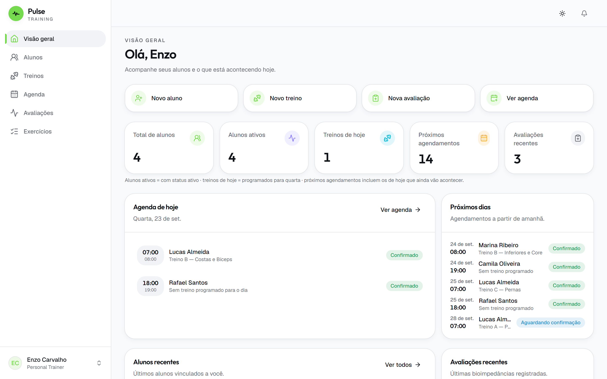
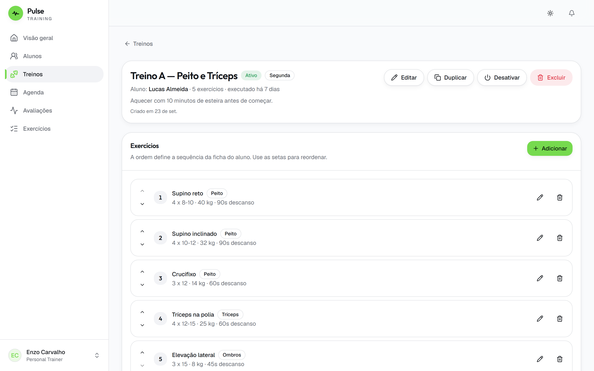
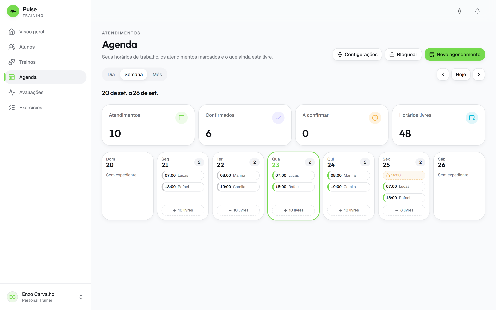
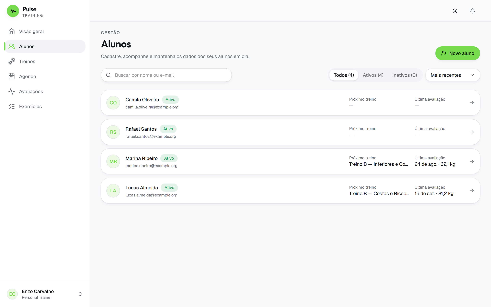
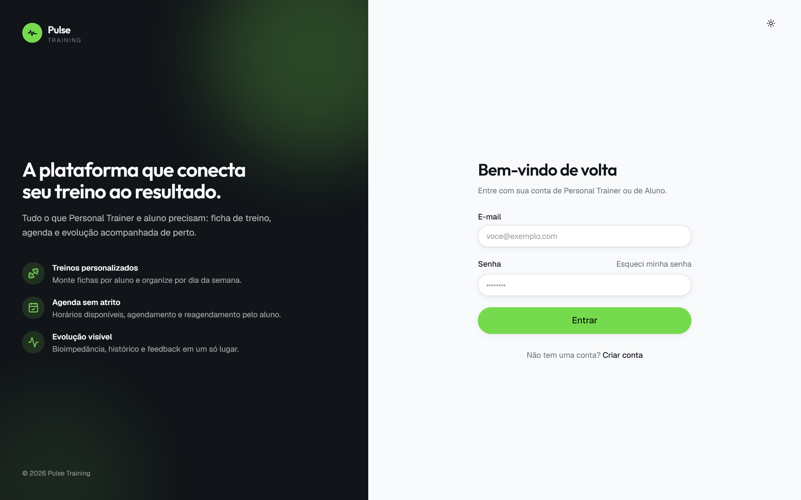
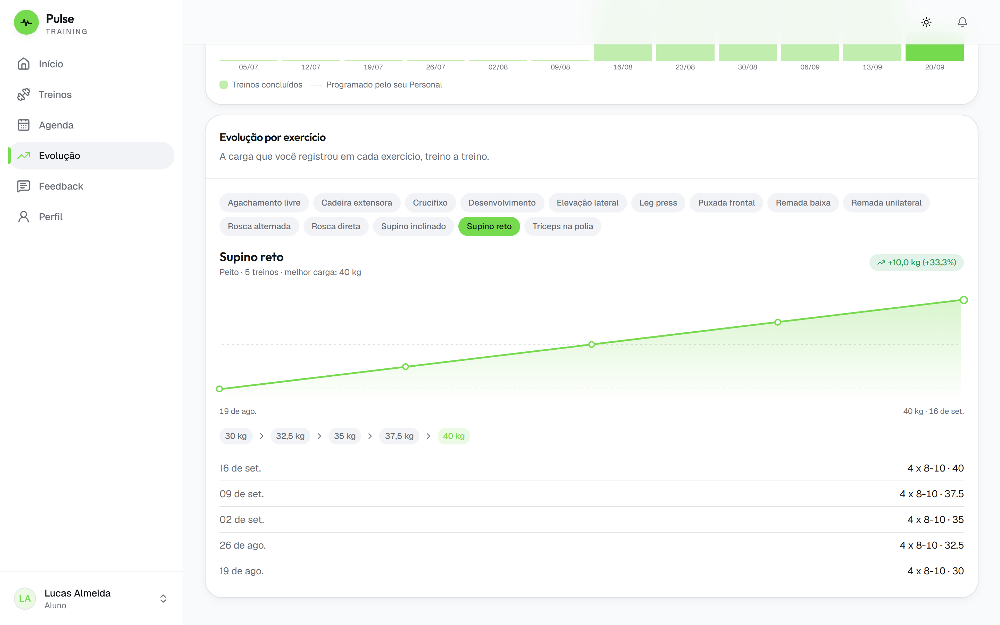
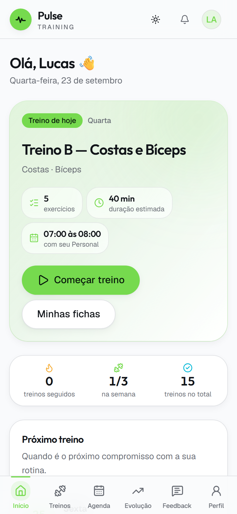
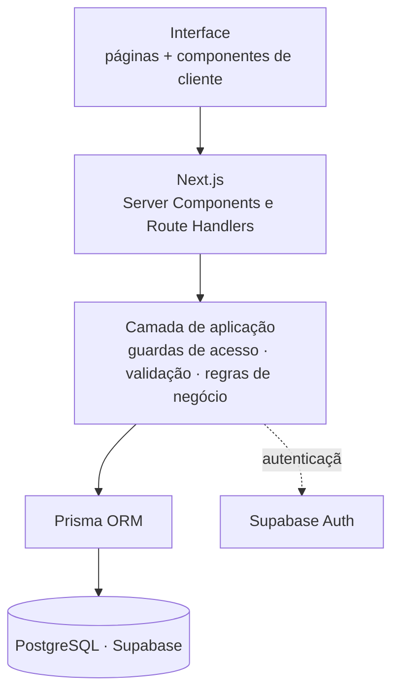

# Pulse Training

Plataforma full-stack para personal trainers gerenciarem alunos, treinos, agenda e evolução física
em um único ambiente — com um portal separado onde cada aluno acompanha o próprio treino.

> **Showcase técnico.** Este repositório apresenta a arquitetura, as decisões de engenharia e as
> telas do Pulse Training. Por se tratar de um produto em desenvolvimento comercial, o código-fonte
> e o ambiente da aplicação são privados e não estão disponíveis publicamente.

---

## <picture><source media="(prefers-color-scheme: dark)" srcset="docs/icons/dark/monitor-smartphone.svg"></picture> Demonstração

### Área do Personal Trainer

  
   
  <b>Visão geral</b> — atendimentos do dia, alunos ativos, próximos agendamentos e avaliações recentes.

<table>
  <tr>
    <td width="50%" valign="top">
      
       
      <b>Montagem da ficha</b> — séries, repetições, carga e descanso por exercício, com reordenação.
    </td>
    <td width="50%" valign="top">
      
       
      <b>Agenda</b> — semana com atendimentos, horários livres e bloqueios. Sobreposição impedida pelo banco.
    </td>
  </tr>
  <tr>
    <td width="50%" valign="top">
      
       
      <b>Carteira de alunos</b> — busca, status, próximo treino e última avaliação.
    </td>
    <td width="50%" valign="top">
      
       
      <b>Autenticação</b> — acesso único para Personal e aluno, com limite de tentativas.
    </td>
  </tr>
</table>

### Área do aluno

<table>
  <tr>
    <td width="68%" valign="top">
      
       
      <b>Evolução</b> — progressão de carga por exercício, treino a treino, a partir do que foi de fato registrado na execução.
    </td>
    <td width="32%" valign="top" align="center">
      
       
      <b>Portal do aluno</b> — treino do dia e execução série a série, desenhado para o celular.
    </td>
  </tr>
</table>

---

## <picture><source media="(prefers-color-scheme: dark)" srcset="docs/icons/dark/info.svg"></picture> Sobre o projeto

O acompanhamento entre personal trainer e aluno costuma ficar espalhado: a ficha em PDF no
WhatsApp, os horários em um caderno, as medidas em uma planilha e a carga da semana passada na
memória de quem treinou. Cada informação vive em um lugar diferente, e nenhuma delas conversa com
as outras.

O Pulse Training reúne esse fluxo em uma aplicação só, com duas visões do mesmo dado:

- **Para o personal**, uma ferramenta de trabalho — carteira de alunos, biblioteca de exercícios
  reaproveitável, montagem de fichas, programação semanal, agenda com regras próprias, avaliações
  de composição corporal e um canal de feedback.
- **Para o aluno**, um app de treino — o que fazer hoje, quanto levantar, quanto descansar, o
  histórico do que já foi feito e a evolução em gráfico.

O isolamento entre contas é requisito de projeto, não detalhe de implementação: um aluno acessa
apenas os próprios dados e um personal apenas os alunos vinculados a ele.

---

## <picture><source media="(prefers-color-scheme: dark)" srcset="docs/icons/dark/layout-dashboard.svg"></picture> Principais funcionalidades

### Personal Trainer

| Área | O que faz |
| --- | --- |
| **Alunos** | Cadastro com senha temporária, busca, edição e desativação sem perder o histórico |
| **Exercícios** | Biblioteca própria com grupo muscular, imagem e vídeo; arquivamento em vez de exclusão quando o exercício já está em uso |
| **Treinos** | Fichas com séries, repetições, carga, descanso e observações; reordenação, duplicação e transferência entre alunos |
| **Programação** | Monta a semana do aluno (segunda: Treino A, quarta: Treino B) e resolve o treino previsto para qualquer data |
| **Agenda** | Horários de trabalho, bloqueios, confirmação, cancelamento e reagendamento |
| **Avaliações** | Bioimpedância com campos opcionais: registra só o que o equipamento mediu |
| **Feedback** | Comentários por aluno, com controle de leitura |
| **Perfil** | Dados profissionais e as regras que governam a agenda (antecedência, janela, cancelamento) |

### Aluno

| Área | O que faz |
| --- | --- |
| **Início** | Treino de hoje, próximo atendimento, resumo da evolução e o último comentário do personal |
| **Execução** | Tela de sessão: exercício atual, séries marcáveis, cronômetro de descanso e registro do que foi feito |
| **Histórico** | Treinos realizados, com duração, cargas e repetições |
| **Evolução** | Progressão de carga por exercício, frequência, sequência e gráficos de composição corporal |
| **Agenda** | Marca, cancela e reagenda dentro das regras do personal, vendo apenas horários realmente livres |
| **Feedback** | Comentários recebidos, com o mais recente em destaque |
| **Perfil** | Foto, contato e dados pessoais |

Notificações internas avisam os dois lados: treino novo, avaliação cadastrada, agendamento
confirmado ou cancelado.

**Escala do projeto:** 58 endpoints de API · 25 páginas · 18 modelos de dados · 16 migrations.

---

## <picture><source media="(prefers-color-scheme: dark)" srcset="docs/icons/dark/code-xml.svg"></picture> Tecnologias

**Frontend** — Next.js 16 (App Router, Server Components) · React 19 · TypeScript 5 em modo
estrito · Tailwind CSS 4 · shadcn/ui sobre Base UI

**Backend** — Next.js Route Handlers · Prisma ORM 7 com driver adapter · Zod + React Hook Form
para validação · sharp para processamento de imagens

**Banco e autenticação** — PostgreSQL 17 no Supabase · Supabase Auth · Supabase Storage

**Qualidade** — Vitest (suíte HTTP contra servidor real, sem mock de banco nem de sessão) ·
Playwright · ESLint

**Infraestrutura** — Vercel (aplicação) e Supabase gerenciado (banco, autenticação e
armazenamento). O ambiente é privado: não há instância pública do produto.

---

## <picture><source media="(prefers-color-scheme: dark)" srcset="docs/icons/dark/network.svg"></picture> Arquitetura

Uma aplicação só: o Next.js serve páginas e API no mesmo processo. As páginas são Server
Components; os componentes de cliente conversam com os Route Handlers, que são o backend.

Três decisões sustentam o resto:

**O dono do dado vem da sessão, nunca da requisição.** Toda consulta carrega o dono da informação
na cláusula de filtro, então um identificador de terceiro simplesmente não encontra
correspondência.

**Páginas e API se protegem de forma independente.** O redirecionamento de páginas não roda nas
rotas de API; cada endpoint aplica a própria guarda, que lê o papel do usuário no banco e não do
token — um token antigo não sustenta um acesso revogado.

**Regras de negócio ficam em funções puras.** Sobreposição de horários, geração de slots, prazos de
cancelamento e datas de calendário são testáveis sem banco e sem HTTP.

---

## <picture><source media="(prefers-color-scheme: dark)" srcset="docs/icons/dark/brain-circuit.svg"></picture> Desafios técnicos

### Corrida por um mesmo horário na agenda

Verificar que o horário está livre e então gravar são duas operações: entre uma e outra cabe uma
requisição inteira. Dois alunos marcando o mesmo horário no mesmo instante passavam os dois.

A regra saiu da aplicação e foi para o banco, como uma **`EXCLUDE` constraint com `btree_gist`**,
combinando igualdade de profissional e data com **interseção de intervalo**. Uma restrição de
unicidade não resolveria: 09:00–10:00 e 09:30–10:30 têm início diferente e ainda assim se
sobrepõem. A constraint considera apenas os status que de fato seguram o horário, e trata o
intervalo como semiaberto — encostar não é sobrepor.

Como o Prisma não representa `EXCLUDE` no schema, a migration foi escrita à mão, e ela se recusa a
aplicar se o banco já contiver sobreposições, apontando o primeiro par conflitante em vez de falhar
com uma mensagem genérica.

### Isolamento entre contas em um banco multi-tenant

Quase toda tabela carrega o identificador do profissional e/ou do aluno, e o dono entra no filtro
de cada consulta — em vez de buscar primeiro e filtrar depois na aplicação.

Um detalhe deliberado: recurso que existe mas não pertence ao solicitante responde **404, não 403**.
Um 403 confirmaria que aquele registro existe. As guardas de acesso concentram essa decisão em um
único lugar, e 30 testes tentam a invasão endpoint por endpoint para provar que a regra vale em
todos eles.

### Data de calendário não é o mesmo que instante

Confundir as duas coisas é o que faz um atendimento aparecer no dia errado. O sistema as separa:
**data de calendário** (o dia do atendimento, da avaliação, do nascimento) trafega como texto e é
guardada sem hora e sem fuso; **instante** (quando o treino foi executado) é um ponto no tempo.

A conversão entre as duas passa obrigatoriamente por um único módulo, que fixa o fuso da aplicação
explicitamente. Nada lê o relógio do processo: sem isso, o mesmo código se comporta de forma
diferente na máquina de quem desenvolve e no servidor de produção, fazendo "hoje" virar amanhã no
fim da tarde. Para provar que a aplicação não depende do fuso do servidor, a suíte inteira roda com
o servidor de teste em UTC.

### Upload de imagem que não confia no cliente

O tipo declarado e a extensão são escolhidos por quem envia e não provam nada. Quem decide se o
arquivo é uma imagem é o **decodificador, lendo os bytes** — e como ele precisa abrir o arquivo de
qualquer forma para redimensionar, a verificação sai no mesmo caminho.

O pipeline recusa pelo tamanho declarado antes de ler o corpo inteiro, aplica um teto de bytes e
outro de megapixels (um arquivo pequeno pode declarar dimensões absurdas e estourar a memória ao
ser decodificado), reencoda para um formato único aplicando a orientação do EXIF e descarta todo
metadado — some, entre outras coisas, a localização de onde a foto foi tirada. O caminho de
armazenamento é montado a partir de identificadores do servidor: nome de arquivo enviado pelo
cliente nunca entra na conta.

### Limite de tentativas que sobrevive a várias instâncias

O contador vive no banco, não na memória do processo: em produção a aplicação pode subir em mais de
uma instância, e um contador local daria a cada réplica o seu próprio limite — ou seja, nenhum. O
incremento é atômico, sem transação e sem corrida entre requisições simultâneas.

Duas decisões de projeto: no login **só as falhas contam** e o acerto zera o contador da conta, de
modo que quem sabe a senha nunca esbarra no limite; e as chaves guardam apenas o **hash** do
endereço ou do e-mail, para que a tabela não se torne uma lista de contas sondadas.

---

## <picture><source media="(prefers-color-scheme: dark)" srcset="docs/icons/dark/flask-conical.svg"></picture> Qualidade

**558 testes automatizados em 36 arquivos.**

A suíte sobe um build de produção da aplicação e conversa com ele por HTTP, contra banco e serviço
de autenticação reais — sem mock de banco nem de sessão. O que o teste exercita é o mesmo caminho
do navegador: cookie, guarda de rota, validação, consulta e resposta.

| Frente | O que cobre |
| --- | --- |
| **Integração HTTP** | Treinos, exercícios, alunos, agenda, avaliações, feedbacks, perfil, notificações e dashboard |
| **Autorização** | 30 testes de invasão: trocar um identificador na requisição e esperar ser barrado |
| **Concorrência** | Dois agendamentos disputando o mesmo horário, resolvidos pelo banco |
| **Fuso horário** | Data de calendário que não escorrega de dia, com o servidor em UTC |
| **Regras de negócio** | Programação semanal, execução de treino, progressão de carga e regras de agenda |
| **Desempenho** | Orçamento de consultas ao banco, com detecção de N+1 |
| **Modelo de dados** | Relações, unicidade e cascatas — incluindo histórico que sobrevive à exclusão da ficha |

---

## <picture><source media="(prefers-color-scheme: dark)" srcset="docs/icons/dark/shield-check.svg"></picture> Segurança

- **Autenticação** gerenciada por provedor dedicado; cookie de sessão restrito ao servidor.
- **Autorização por papel** (Personal / Aluno) lida do banco a cada requisição, nunca do token.
- **Isolamento entre usuários** com o dono da informação no filtro de toda consulta; 404 em vez de
  403 para não confirmar a existência de recursos alheios.
- **Validação de entrada** por schema em todos os endpoints que recebem corpo.
- **Limite de tentativas** em login, cadastro e recuperação de senha, compartilhado entre
  instâncias.
- **Conflito de agenda** impedido por constraint no banco, não apenas pela aplicação.
- **Upload verificado por decodificação**, com teto de bytes e de pixels e remoção de metadados.
- **Cabeçalhos de segurança e CSP** em todas as respostas; respostas de API sem cache.
- **Segredos fora do repositório**, com as chaves privilegiadas usadas somente no servidor.

---

## <picture><source media="(prefers-color-scheme: dark)" srcset="docs/icons/dark/book-open.svg"></picture> Aprendizados

O que a construção desta plataforma exercitou, concretamente:

- **Modelagem relacional de um domínio real** — multi-tenancy por coluna, e a decisão de guardar o
  histórico de treino como *retrato* (nome, séries e carga do momento) em vez de referência, para
  que editar ou excluir uma ficha não reescreva o passado do aluno.
- **Levar invariantes para a camada certa** — a regra de não sobrepor atendimentos não é confiável
  na aplicação, onde existe uma janela entre ler e gravar; no banco, como constraint, ela é
  garantia.
- **Autorização como propriedade do sistema, não como condicional espalhada** — dono no filtro,
  papel lido do banco, 404 em vez de 403, e uma suíte que tenta a invasão para provar a regra.
- **Tempo é duas coisas diferentes** — separar data de calendário de instante, fixar o fuso da
  aplicação e rodar os testes em UTC para que o comportamento não dependa de onde o código roda.
- **Testar pelo caminho real** — servidor de produção, HTTP, banco e autenticação de verdade.
  Testes que mockam o banco passam enquanto a aplicação quebra.
- **Tratar entrada externa como hostil** — validação por decodificação nos uploads, schema nos
  corpos de requisição e limite de tentativas compartilhado.

---

## <picture><source media="(prefers-color-scheme: dark)" srcset="docs/icons/dark/user-round.svg"></picture> Autor

**Enzo Carvalho Calligaris**

- GitHub: [@EnzoCalligaris](https://github.com/EnzoCalligaris)
- LinkedIn: [enzo-carvalho-calligaris](https://www.linkedin.com/in/enzo-carvalho-calligaris)
